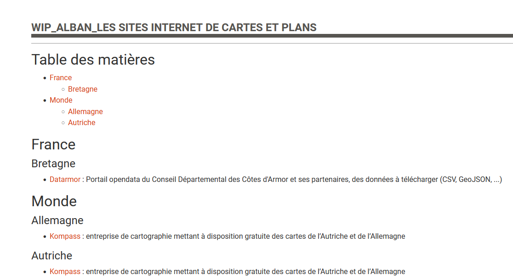

# Génrer un article Bokeh contenant une sitothèque à partir d'un tableur

Script pour générer le code HTML d'un article Bokeh contenant une sitothèque à partir d'un tableur

_Basé sur l'article ID 167 ([Les ressources cartographiques sur internet](https://www.archires.archi.fr/cms/articleview/id/167))_



## Forme du tableur

|Category|Sub-category|Name|URL|Description|
|---|---|---|---|---|
|France|Bretagne|Datarmor|https://datarmor.cotesdarmor.fr/|Portail opendata du Conseil Départemental des Côtes d'Armor et ses partenaires, des données à télécharger (CSV, GeoJSON, ...)|
|Monde|Autriche,Allemagne|Kompass|https://www.kompass.de/|entreprise de cartographie mettant à disposition gratuite des cartes de l’Autriche et de l’Allemagne|

## Spécifications du tableur

* Il n'est pas possible de placer un site dans plusieurs categories en utilisant une seule ligne : il faudra créer une seconde ligne
* Il est en revanche possible de placer un site dans autant de sous-catégories en séparant le nom des sous-catégories par une virgule.

## Formats de fichier supportés

* `.xls`
* `.xlsx`
* `.ods`
* `.csv`

## Forme du fichier final

### Exemple (fait manuellement)

``` HTML
<h1 id="toc">Table des matières</h1>

<ul>
	<li><a href="#france" title="Accéder à la catégorie France">France</a>

	<ul>
		<li><a href="#bretagne" title="Accéder à la sous-catégorie Bretagne">Bretagne</a></li>
	</ul>
	</li>
	<li><a href="#monde" title="Accéder à la catégorie Monde">Monde</a>
	<ul>
		<li><a href="#allemagne" title="Accéder à la sous-catégorie Allemagne">Allemagne</a></li>
		<li><a href="#autriche" title="Accéder à la sous-catégorie Autriche">Autriche</a></li>
	</ul>
	</li>
</ul>

<h1 id="france">France</h1>

<h2 id="bretagne">Bretagne</h2>

<ul>
	<li><a href="https://datarmor.cotesdarmor.fr/" target="_blank" title="Accéder à Datarmor">Datarmor</a> : Portail opendata du Conseil Départemental des Côtes d'Armor et ses partenaires, des données à télécharger (CSV, GeoJSON, ...)</li>
</ul>

<h1 id="monde">Monde</h1>

<h2 id="allemagne">Allemagne</h2>

<ul>
	<li><a href="https://www.kompass.de/" target="_blank" title="Accéder à Kompass">Kompass</a> : entreprise de cartographie mettant à disposition gratuite des cartes de l'Autriche et de l'Allemagne</li>
</ul>

<h2 id="autriche">Autriche</h2>

<ul>
	<li><a href="https://www.kompass.de/" target="_blank" title="Accéder à Kompass">Kompass</a> : entreprise de cartographie mettant à disposition gratuite des cartes de l'Autriche et de l'Allemagne</li>
</ul>
```

### Avec variables

``` HTML
<h1 id="toc">Table des matières</h1>

<ul>
	<li><a href="#{lowerCategory1}" title="Accéder à la catégorie {category1}">{category1}</a>

	<ul>
		<li><a href="#{lowerSubcategory1}" title="Accéder à la sous-catégorie {subcategory1}">{subcategory1}</a></li>
        <li><a href="#{lowerSubcategory2}" title="Accéder à la sous-catégorie {subcategory2}">{subcategory2}</a></li>
	</ul>
	</li>
	<li><a href="#{lowerCategory2}" title="Accéder à la catégorie {category2}">{category2}</a></li>
</ul>

<h1 id="{lowerCategory1}">{category1}</h1>

<!-- Pour les liens sans sous-catégories -->

<ul>
	<li><a href="{URL}" target="_blank" title="Accéder à {name}">{name}</a> : {description}</li>
</ul>

<h2 id="{lowerSubcategory1}">{subcategory1}</h2>

<ul>
	<li><a href="{URL}" target="_blank" title="Accéder à {name}">{name}</a> : {description}</li>
    <li><a href="{URL}" target="_blank" title="Accéder à {name}">{name}</a> : {description}</li>
</ul>

<h2 id="{lowerSubcategory2}">{subcategory2}</h2>

<ul>
	<li><a href="{URL}" target="_blank" title="Accéder à {name}">{name}</a> : {description}</li>
    <li><a href="{URL}" target="_blank" title="Accéder à {name}">{name}</a> : {description}</li>
</ul>

<h1 id="{lowerCategory2}">{category2}</h1>

<!-- etc. -->
```

## Mémo

* Bien penser à `trim()`
* pour la génération des identifiants des catégories + sub-cat, ~~prendre n° de ligne + ~~ nom en `lower()`
* Trier les catégories + sub-cat par ordre alphabétique
* Utiliser pandas pour get les données
* utiliser beautifulSoup pour l'html