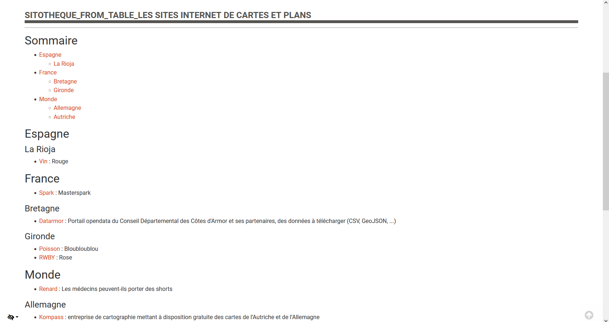

# Génrer un article Bokeh contenant une sitothèque à partir d'un tableur

Script pour générer le code HTML d'un article Bokeh contenant une sitothèque à partir d'un tableur

_Basé sur l'article ID 167 ([Les ressources cartographiques sur internet](https://www.archires.archi.fr/cms/articleview/id/167))_

## Forme du tableur

|Category|Sub-category|Name|URL|Description|
|---|---|---|---|---|
|France|Bretagne|Datarmor|https://datarmor.cotesdarmor.fr/|Portail opendata du Conseil Départemental des Côtes d'Armor et ses partenaires, des données à télécharger (CSV, GeoJSON, ...)|
|Monde|Autriche|Kompass|https://www.kompass.de/|entreprise de cartographie mettant à disposition gratuite des cartes de l’Autriche et de l’Allemagne|

## Spécifications du tableur

* Il n'est pas possible de placer un site dans plusieurs categories / sous-catégories en utilisant une seule ligne : il faudra créer une seconde ligne

## Formats de fichier supportés

* `.xls`
* `.xlsx`
* `.ods`
* `.csv`
* `.tsv`
* `.txt` __si des tabulations sont utilisées comme séparateur__

## Forme du fichier final

[Voir le fichier HTML d'exemple](example.html)